# Implemented Features
## Entry point
The plugin is accessible through the Git Menu. It is at the bottom and upon clicking it opens
on the editor tab of the IDE. Upon closing the plugin the changes made remain there, so the user can
pick up where they left off.

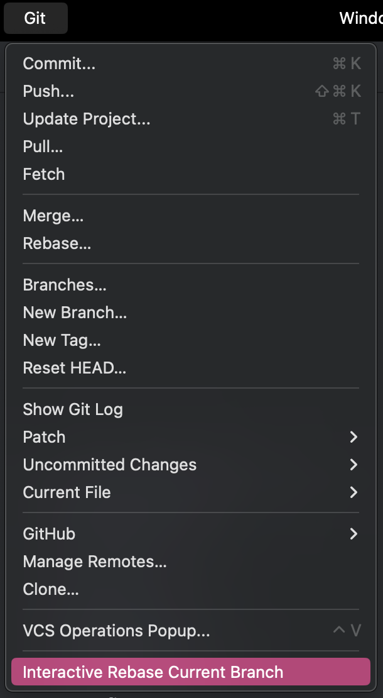

## The Branch
Immediately upon opening, a visual representation of the checked out branch appears on the screen,
with the commits being displayed with their respective commit messages. At the bottom of the
branch a long fading line indicates the direction from which the branch stems. The graph shows only
the commits from the point where the branch diverges from the main or master.

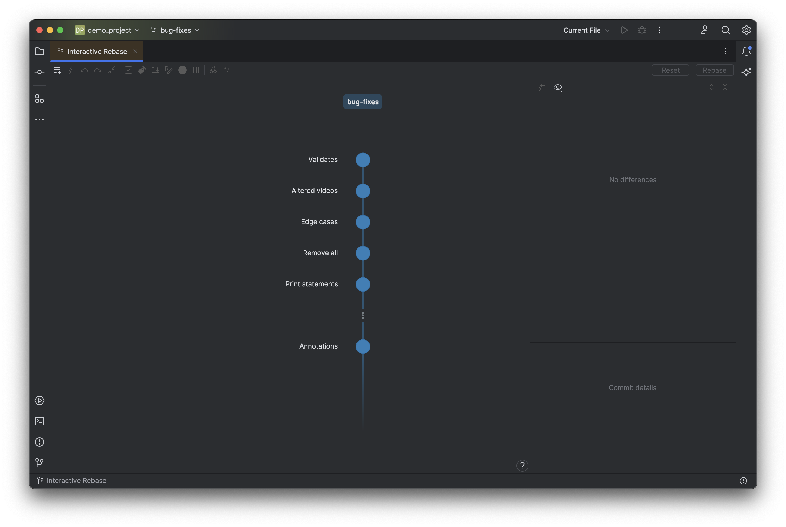

## The Commit Information
When selecting a commit, its information is displayed on the right side of the screen - the changes
files, the author, the date and the commit hash. If multiple commits are selected, the side panel
combines their file changes and shows the information of every commit.

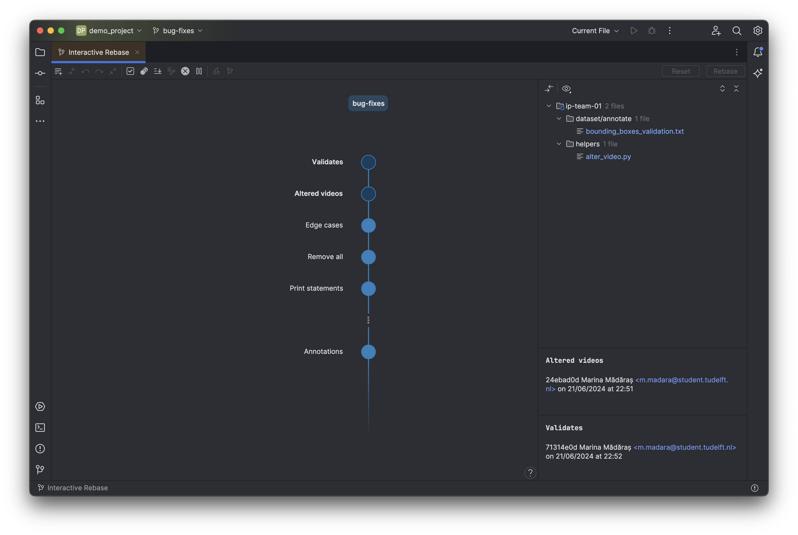

## Second Branch
The leftmost button of the toolbar allows the user to select a second branch to be added to the
graph. After clicking on it, a side panel opens on the left side of the screen, presenting a list of all
local branches, except the one the user is currently on. Clicking on a branch name selects it and
automatically adds it to the graph as a second branch. Then the commits presented on the initial
branch will be the ones from the point of diverging of the two branches. Clicking again on the selected
branch name in the list of branches deselects it and returns the graph to its initial view.

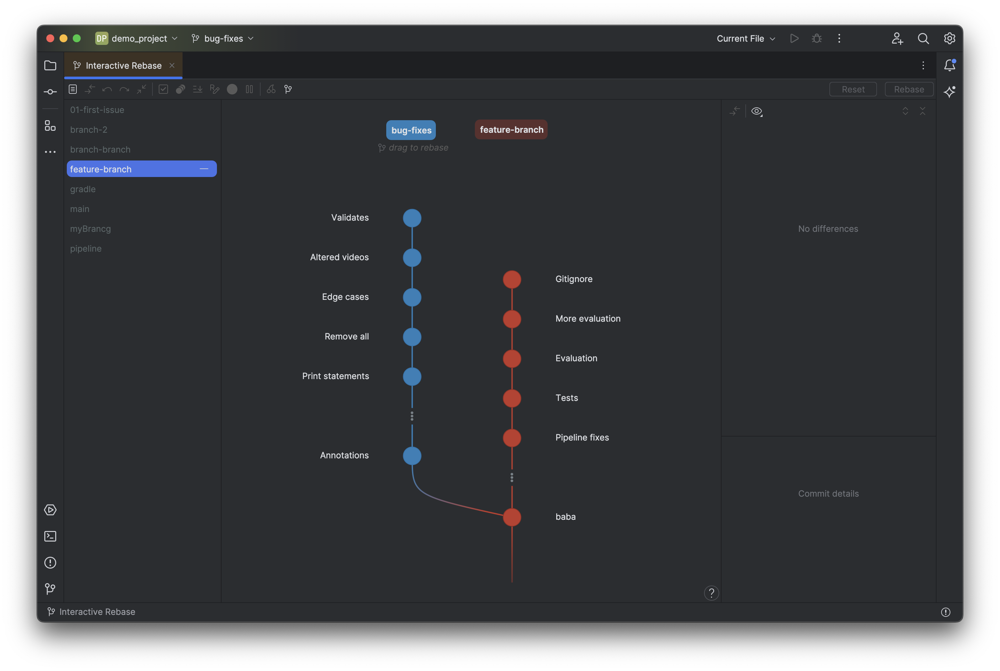

## Keyboard Navigation
Keyboard Navigation
For accessibility purposes, we have added keyboard navigation of the graph. Clicking the `↑` key
selects the bottom most commit of the checked out branch. From then on going up and down through
the commits happens with the `↑` and `↓` keys. Switching between the branches is enables through the
`←` and `→` keys. The user can select multiple commits in a range through `Shift` or can select multiple
commits one-by-one through `Ctrl` / `Command` . If the user is on the left branch, pressing `←` takes them
to the left side panel if it is open. There, browsing through the list is also enabled through the `↑` and
`↓` keys. To return to the graph one should press `→`.

## Git Commands
Our product allows for the execution of nine Git Commands : reword, reorder, pick, stop-to-edit,
drop, squash, fixup, cherry-pick, rebase onto. In the following subsection, we will go through every
one of them, how it can be used and what it does.

### Reword
Reword is a Git command that allows the user to change the subject of a certain commit.
In our plugin, selecting a single commit on the checked out branch enables the reword button in the
toolbar. Clicking reword opens a text field where the new subject could be typed. Clicking outside of
the text field makes the change. The new subject is colored in blue, indicating that it will be reworded.
Another way to reword is by double-clicking the commit subject which opens the aforementioned text
field. Closing it can also be achieved through pressing `Enter`. Lastly, rewording can also be executed
through the keyboard combination `Alt R` / `Option R`.

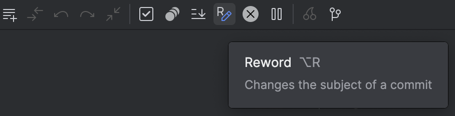

### Drop 
Drop is a Git command that allows the user to remove certain commits form the commit
history. Selecting the commits on the checked out branch enables the drop button in the toolbar
above. Clicking that button grays out those commits and crosses out their subjects, thus giving a
visual indication that they will be removed from the commit history. The drop action is also accessible
through the keyboard shortcut `Delete` / `Backspace` .

### Fixup
Fixup is a Git command that allows the user to combine certain commits into one. Selecting the commits on the checked 
out branch enables the fixup button in the toolbar above. When
clicking that button, the commits automatically get combined into the oldest selected commit. The
commit has two overlapping circles to give a visual indication that it consists of multiple commits.
Selecting it shows on the right side all the commits that are inside. If only a single commit is selected,
it gets fixed up with the one underneath it. Selecting only the bottom most commit does not allow
the action to be performed. Fixup is also accessible through the keyboard shortcut `Alt F` / `Option F` .

### Squash
Squash is a Git command that allows the user to combine certain commits into one and
set a new subject for the combined commit. In the plugin, selecting the commits on the checked out
branch enables the squash button in the toolbar above. Upon clicking that button, the commits
automatically get combined into the oldest selected commit and the text field for rewording opens up
allowing the user to set the subject. The commit has two overlapping circles to give a visual indication
that it consists of multiple commits. Selecting it shows on the right side all the commits that are
inside. If only a single commit is selected, it gets squashed with the one underneath it. Selecting only
the bottom most commit does not allow the action to be performed. Squash is also accessible through
the keyboard shortcut `Alt S` / `Option S`.

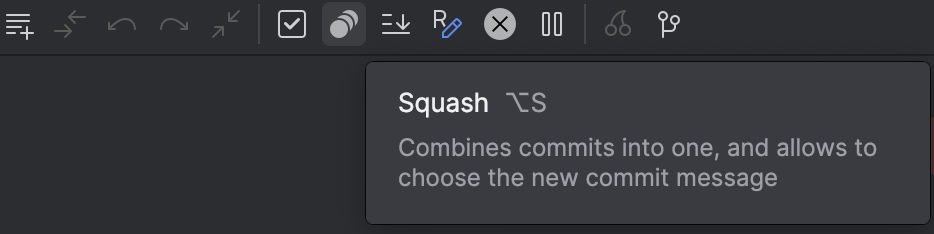

### Stop-to-Edit 
Stop-to-Edit is a Git command that allows the user to pause on a certain selected
commit and change the files during the rebase process. In the plugin, selecting the commits on the
checked out branch enables the stop-to-edit button in the toolbar above. Upon clicking that button,
the commits get a pause icon in them, indicating that the rebasing process will stop on them for the
user to make a change. Stop-to-edit is also accessible through the keyboard shortcut `Alt E` / `Option E`.

### Pick 
Pick is a Git command that removes all the previously applied interactive rebase commands
and returns the commit to its initial state. In the plugin, selecting the commits on the checked out
branch, that have had changes made on them, enables the puck button in the toolbar above. Upon
clicking that button, all visual indicators on the commit get cleared. Pick is also accessible through
the keyboard shortcut `Alt P` / `Option P` 

### Reorder 
Our plugin allows for reordering of the commits in the commit history of the checked out
branch. In the plugin, this is enabled through dragging and dropping commits along the branch with
the mouse. For accessibility purposes, reordering can also be executed through keyboard shortcuts.
`Alt ↑` / `Option ↑` and `Alt ↓` / `Option ↓` allow for moving a singular selected commit up and down.

### Cherry-Pick 
Cherry-picking is a Git command that allows the user to choose a commit from
another branch, make a copy of it, and add it to the head of their checked out branch. In our product,
selecting a commit for the added branch enables the cherry-pick button in the toolbar above. Upon
clicking on it, a copy of that commit gets created and placed at the head of the checked out branch,
with a cherry icon drawn in it. In the meantime, the original selected commit is grayed out and
also has a cherry icon inside, to show that it has been cherry-picked. An alternative way to perform
cherry-picking is by dragging a commit from the added branch and placing it anywhere on the checked
out branch. Cherry-pick is also accessible through the keyboard shortcut `Alt C` / `Option C`.

### Rebase onto
Rebase onto is a Git command that allows the user to rebase a series of commits on
a new base commit. In our product, we support rebasing the checked out branch on top of a commit
on the added branch. After selecting the commit that will be the new base, and clicking the rebase
button in the toolbar above, the graph gets updated and the connection between the two branches -
moved. If no commit has been selected as the new base, the default is a normal rebase, where the
checked out branch is rebased on the head of the second branch. Furthermore, rebasing can also be
executed by dragging the name of the checked out branch on top of the name of the added branch.
Finally, rebasing can also be triggered with the keyboard shortcut `Alt Shift R` / `Option Shift R`. 

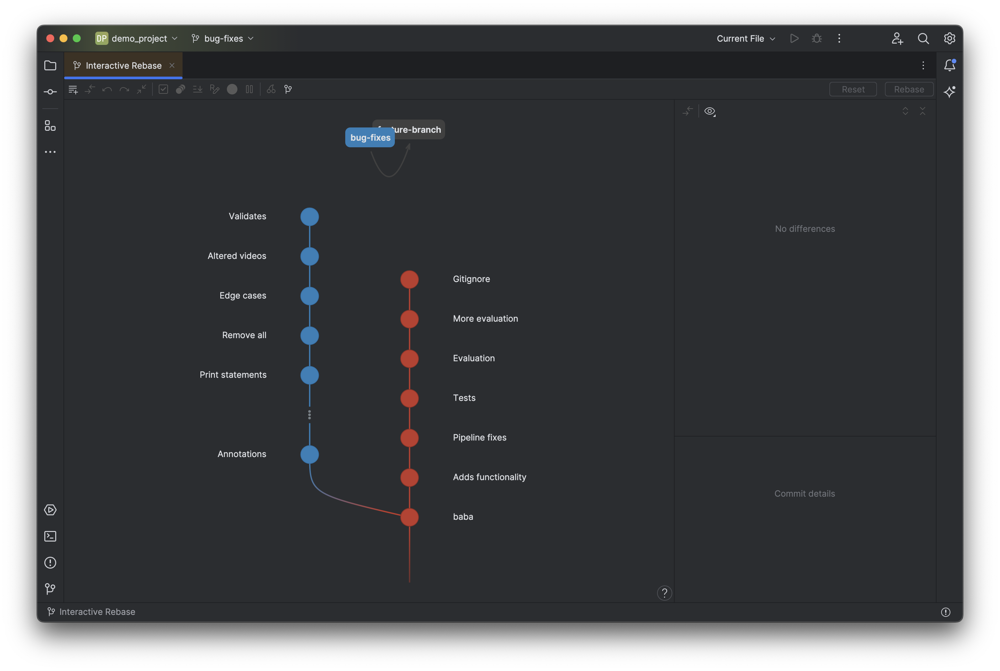
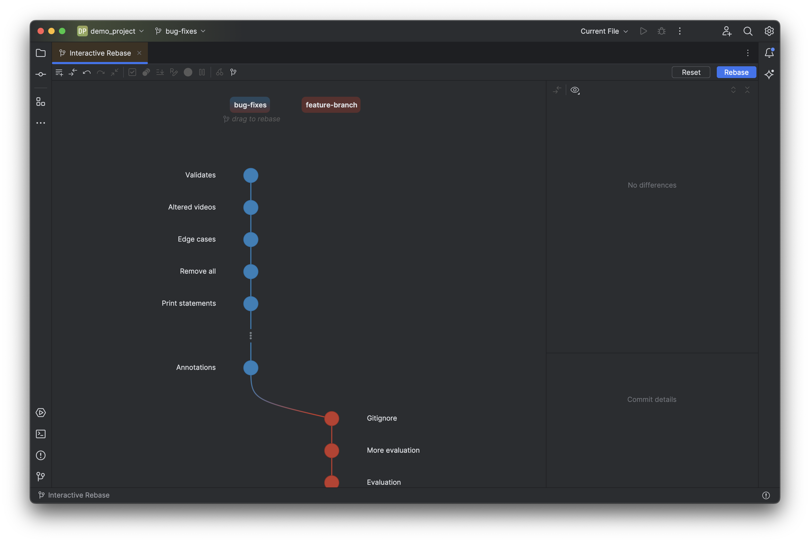

### Context Menu
After selecting commits, the user can right-click for a context menu to open 20, that shows all of 
the available rebase commands. Thus, all commands can be performed from that context menu, too.

    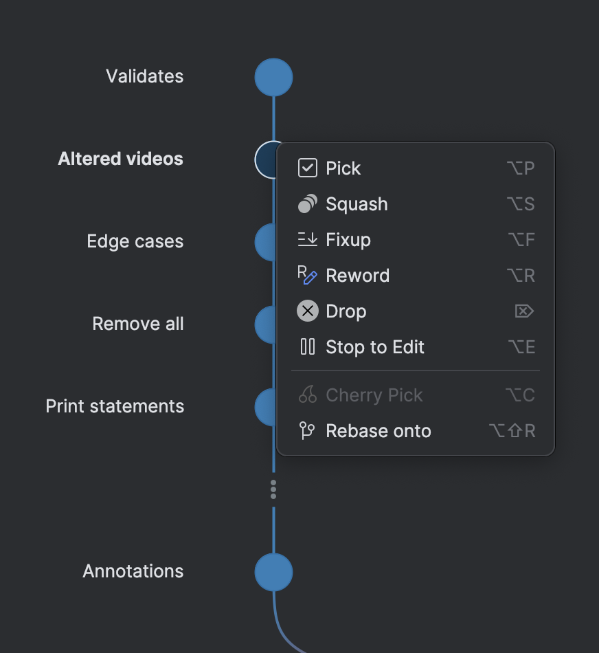

### Undo and Redo
In order to have a better control over the changes made, the plugin also supports undo and redo
actions, which respectively remove or add the latest change made on the graph. They can be accessed 
through the toolbar or through keyboard shortcuts - `Ctrl Z` / `Command Z` for undo and `Ctrl Shift Z`
/ `Command Shift Z` for redo.

### Collapsing a Branch
If a branch has more than seven commits to be displayed, the graph shows part of the commits
collapsed. This is visualized through the three consecutive vertical dots. Clicking on them expands the
whole branch. To collapse it back, the user can click the collapse button in the toolbar. An alternative
way to collapse is to select specific commits in a range from either branch and click the button. The
action is also accessible through a keyboard shortcut - `Ctrl C` / `Command C`.

### Graph Difference View
After all the changes have been made to the graph, the user can compare its current state to the
initial one through the See Difference button in the toolbar. Clicking that button opens a dialog,
in which on the left side is the original layout of the graph, while on the right side is the current view.
After comparing, the user can close the dialog and proceed working. The See Difference button is also
accessible through the keyboard shortcut `Ctrl D` / `Command D`.

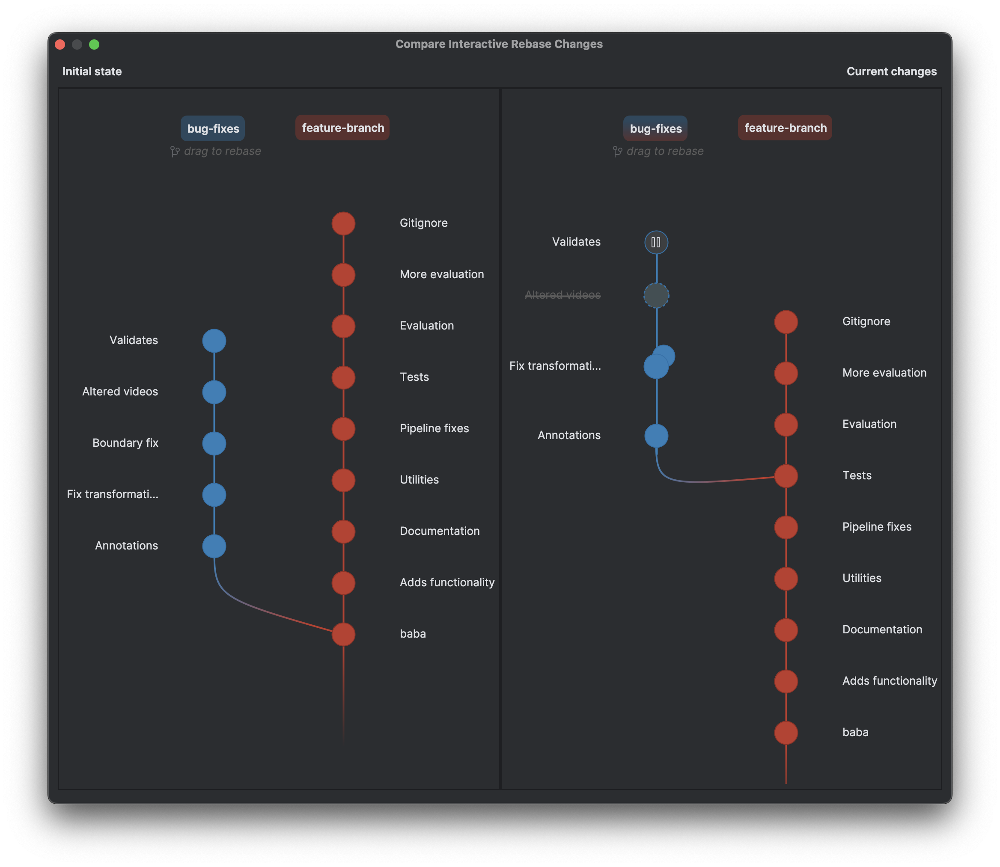

### Resetting and Rebasing
Two buttons are on the right side of the toolbar - Reset and Rebase. Both of them are active only
if a change was introduced to the graph.
Upon clicking the reset button the graph is returned back to its initial state and all Git commands
applied to it are reverted. Reset is also accessible through the keyboard shortcut `Ctrl R` / `Command R`.
After all the desired changes have been made, clicking the Rebase button starts the actual process
of rebasing. In the case where cherry-picking is also one of the changes, the cherry-picking action is
executed before the rebasing. If the cherry-picking fails, the rebasing is never started. Starting the
rebase process can also be achieved through the keyboard shortcut `Alt Enter` / `Option Enter`.

### Progress of Rebasing
When the rebase process stops due to conflicts or stop-to-edit the user can keep track of which
commit they are stopped on through the progress visualization on the graph. The green commits are
those that have already been successfully rebased and the commit on which the user has stopped is
yellow. If it stopped due to stop-to-edit the commit has a pause icon inside. Otherwise, in the case of
conflicts, it has a warning icon.

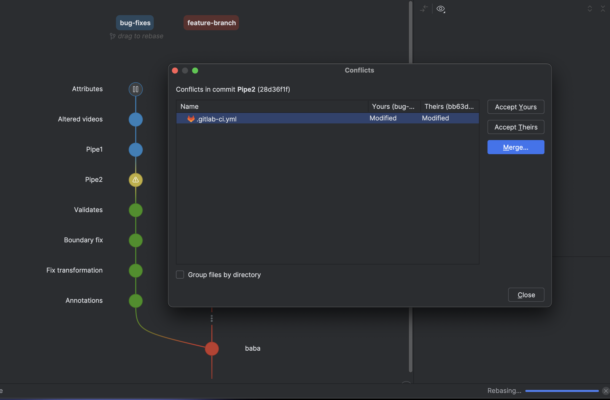

### Continue Rebasing or Abort
After applying the necessary changes or fixes, while being stopped at a commit, the user is presented
with two buttons in the right corner of the toolbar - continue and abort. If abort is pressed, the
whole process will quit and the graph will be restored to its initial state. Continue is simply proceeding
with the rebasing.

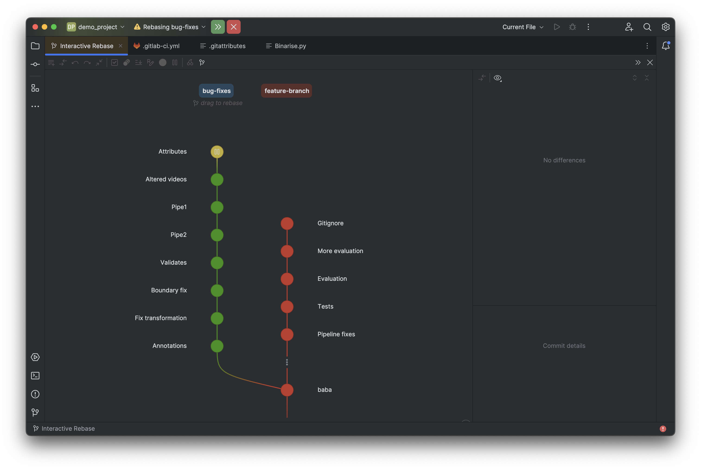

# Known Bugs 
2. The virtual file does not get deleted when closing the project.
3. In case the cherry-pick fails, there is no way to undo that specific action, other than resetting all changes.
4. The labels of the branch names and the graph might blink once when the user is starting to drag. That is due to moving the
component forward because of reparenting.
5. The icons for the actions are not representative or custom. 
6. Nested squashing is treated as a single flat squash, which means that multiple squash actions are undone as a 
singular squash. There are a lot of edge cases when combining squashing and undoing.
7. If a person has a lot of local branches when displaying the side panel view with the branches, the
UI freezes or is very slow. To fix that there should be some kind of paging of the side panel or loading when you
scroll.
8. If there are very long branch names, the names of the commits get very far away from the commits because of the way
we align the components.
9. If there is a very long branch and the user is dragging a commit the panel does not scroll with the dragging. So,
if the topmost commit is being dragged down it can only be dragged until the end of the screen. 
10. Currently, cherry-picking is always executed at the beginning before the rebasing process. Instead, the rebasing 
should be interrupted to do cherry-picking exactly at the moment when the user does it, so, as to minimize conflicts. 
11. Currently, we are not checking whether the commits can be interactively rebased from here. So, when
displaying the graph, that check should be made for each commit and gray out the commits that cannot be rebased, and 
also make them not interactive. 
12. The help button at the bottom does not work with linux, and it also is not fixed to the screen but is always at the
bottom, which means that if there is a very long branch, the user needs to scroll. 
13. If the user is on a branch and adds another branch to the view, and then checks out to the added branch, the view 
breaks because the same branch is displayed twice and gives a git error. 
14. The whole refreshing logic needs to be redone as  all the components are removed and added again multiple times 
for every singular change. 
15. The model for rebasing is created with all the commits on the branch. Instead, the oldest 
modified commit should be detected, and the model should be created with only the commits from then on.
16. For any branch that does not have a diverging commit from main or master we just display no commits.
17. 

# Features to implement
1. Change the cursor when it is hovering on top of a draggable component.
2. Make the line connecting the branches draggable, so, as to enable rebasing through dragging.
3. When selecting a squashed commit, all the commits that are into it should be displayed on the graph.
This also enables unsquashing a particular commit through drag and drop.
4. The expanding of a branch should be an action and also have a  keyboard shortcut for it.
5. The user should be able to go through the right side panel using only the keyboard.
6. Add a search bar for the branches.

