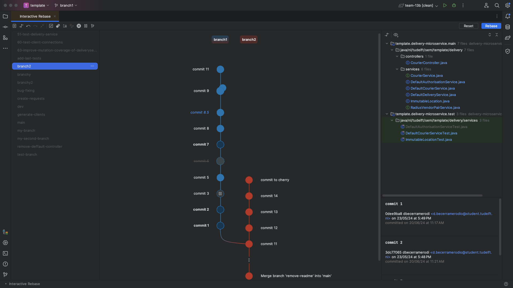
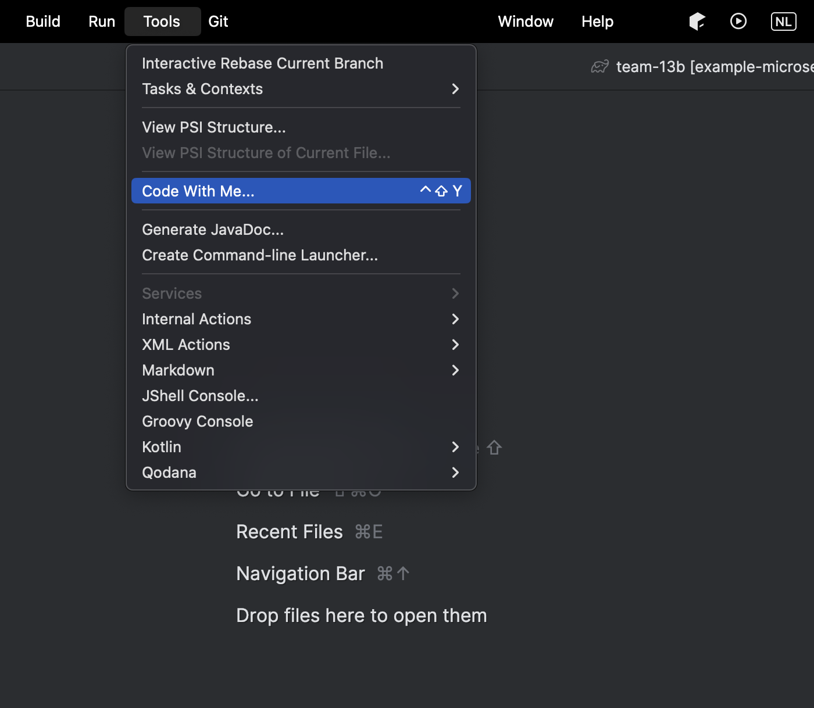
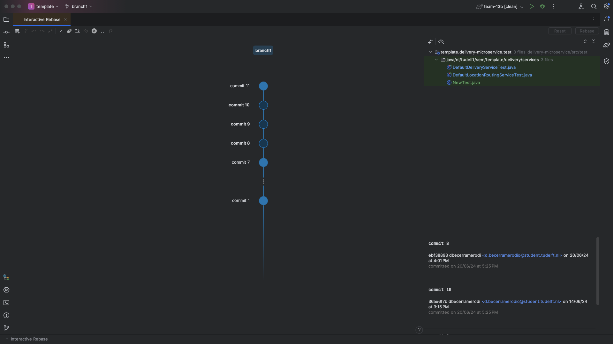
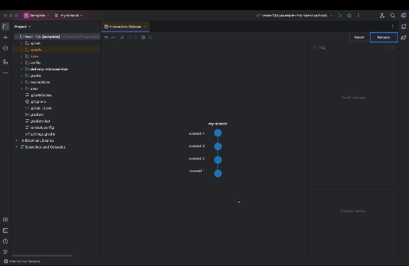
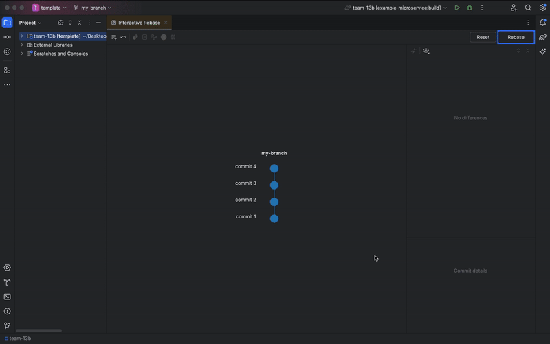
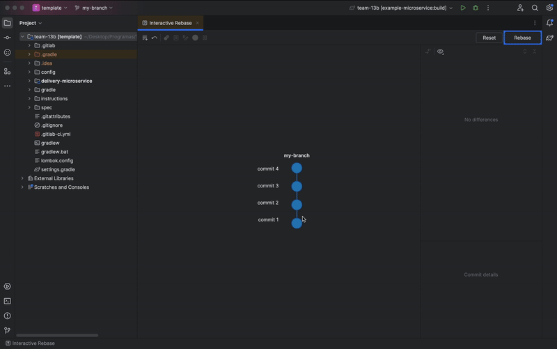
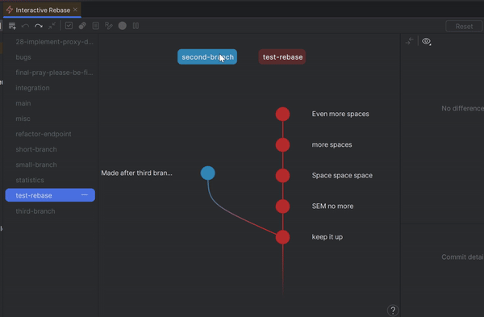
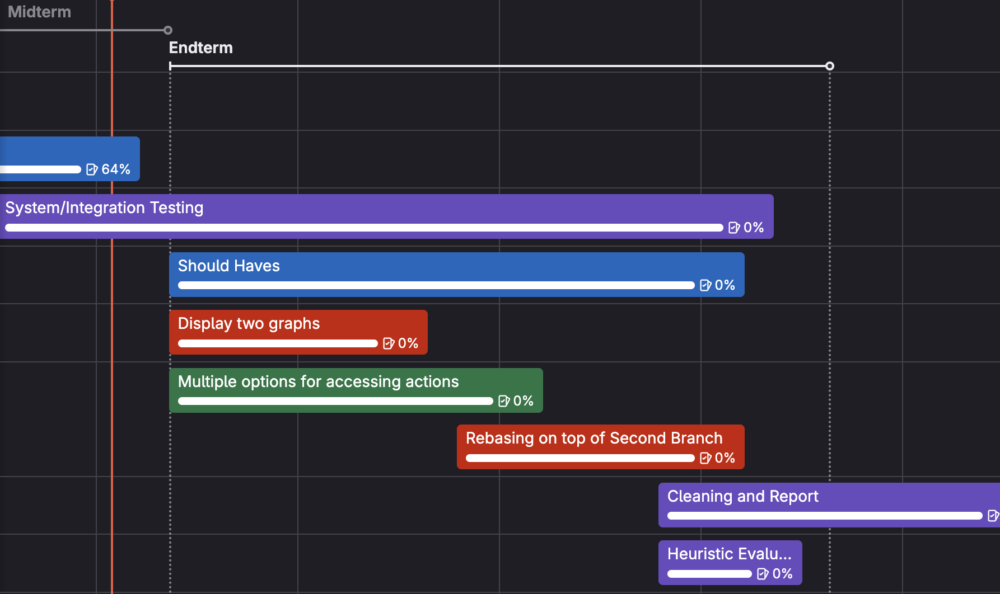

# A More Interactive Rebase

---
<!-- Plugin description -->
A More Interactive Rebase for JetBrains is a plugin for the integrated development
environments (IDEs) from JetBrains. The tool makes it easier for you to perform Git Interactive Rebase actions, without 
the need for a command line, by providing a clear 
graphical visualization of the commit history and the changes you want to perform on it.

⚠️ DISCLAIMER:
This plugin is still under very early stages of development, consider this to be an access to the pre-alpha version
of the plugin. It may be possible that certain functionalities do not work as intended or do not work at all. Your
feedback would prove very useful for us. Thanks!
<!-- Plugin description end -->

## 📋 Table of Contents

1. ✨ [Features](#-features)
2. ⚙ [Installation](#-installation)
3.  ⚡ [Quick Start](#-quick-start)
4. 🔗 [Dependencies](#-dependencies)
5. 🤝 [Contributing](#-contributing)
6. ❓ [Support](#-support)
7. 🗺 [Roadmap](#-roadmap)
8. ✒ [Authors and Acknowledgement](#-authors-and-acknowledgment)

## ✨ Features
A More Interactive Rebase offers the following functionality for a better user experience:
* Opens in the editor tab for a better visualization
* Shows clearly the commit history in the form of a graph
* Gives details about the commits and their file changes
* Allows performing interactive rebase actions on selected commits
* Allows reordering of commits by drag-and-drop
* Displays two branches with their relation visually
* Allows changing the base of a branch on top of another branch
* Shows the difference between the changed graph and the initial state
* Allows for cherry-picking a commit
* Shows the progress of the rebase and the commit on which it has stopped due to conflicts

[//]: # (Add short video here)

## ⚙ Installation
You can easily get started with setting up the plugin by following these guidelines:

### Guidelines for Setting up

1. Download the Plugin zip on your device
2. Extract the files in it in a folder
3. Open a JetBrains IDE and navigate to <kbd>Settings/Preferences</kbd> > <kbd>Plugins</kbd> >
   <kbd>⚙️</kbd> > <kbd>Install plugin from disk...</kbd>
4. Navigate to the folder of the Plugin and select `interactive-rebase-jetbrains-version.jar`
5. The Plugin should be in the list of Plugins and you can search for it by name *A More Interactive Rebase*
6. Click on the Plugin and enable it
7. Restart your IDE

## ⚡ Quick Start
### Opening the Plugin
Navigate to <kbd>Tools</kbd> > <kbd> Interactive Rebase Current Branch</kbd>. The Plugin opens as a file in
the editor tab. The branch drawn shows the latest commits on the checked out branch. Closing the Plugin and opening it
again keeps the changes that were made.

### Commit Information
Clicking on one or multiple commits selects them. The commit information and file changes of the selected commits
are presented on the right side of the screen. Double-clicking on a file change opens its diff and shows the changes.

### Interactive Rebase Actions
After selecting the commits, the buttons that are *active* show the available Interactive Rebase actions. **It is
important to note that any changes made on the graph are not actually executed until the `Start Rebasing` button
is pressed. The idea of the graph is to show a preview of how the commit history will look in the end.**  All actions 
can be taken in various ways including the action toolbar, a context menu opened on a right click and keyboard shortcuts
If you are not very familiar with the Interactive Rebase actions that Git has to offer, you can read the
[Rewriting History](https://git-scm.com/book/en/v2/Git-Tools-Rewriting-History) Chapter provided by Git for more information.

* **<u>Drop</u>** - After selecting commits, pressing the `Drop` button will remove the selected commits from the commit 
  history. The action can also be performed by selecting one or multiple commits and pressing `Backspace` / `Delete` or 
  by opening the context menu and selecting the action.

* **<u>Fixup</u>** - If there is only one selected commit, pressing the `Fixup` button will perform fixup of that
  commit with the previous one (older in the commit history). In the case where multiple commits are selected,
  they are fixed up into the oldest selected commit. This action combines automatically the commit messages of the
  selected commits. The action can also be performed by selecting one or multiple commits and pressing
  `Option` / `Alt` + `F` or by opening the context menu and selecting the action.

* **<u>Pick</u>** - Selecting the commits and pressing `Pick` reverts all changes done on them except for reordering.
  The action can also be performed by selecting one or multiple commits and pressing `Option` / `Alt` + `P` or by opening 
  the context menu and selecting the action.

* **<u>Reorder</u>** - You can drag and drop the commits along the branch if you want to reorder them. The action can
  also be performed by selecting one or multiple commits and pressing `Option` / `Alt` + `⭡` to move the commit upward or
  `Option` / `Alt` + `⭣` to move the commit downward.

* **<u>Reword</u>** - If a single commit is selected you can click the `Reword` button that opens a text field
  in place of the commit message. Alternatively, if there is no selected commit, you can just double-click on a
  commit message, which will also enable the text field. The action can also be performed by selecting one commit and 
  pressing `Option` / `Alt` + `R` or by opening the context menu and selecting the action.You can edit the message and 
  press `Enter` or click anywhere outside of the text field. If you want to cancel your rewording, pressing `Escape` 
  closes the text field.

* **<u>Squash</u>** - If there is only one selected commit pressing the `Squash` button will squash that commit with the
  previous one (older in the commit history). In the case where multiple commits are selected, they get squashed into
  the oldest selected commit. After squashing, a text field opens for you to reword the commit message for the squashed 
  commit. The action can also be performed by selecting one or multiple commits and pressing `Option` / `Alt` + `S` 
  or by opening the context menu and selecting the action.

* **<u>Stop to Edit</u>** - After selecting commits and pressing the `Stop to Edit` button the IDE opens each commit
  in chronological order (from oldest to newest) and allows you to make changes to that commit (amend it).
  After having made your changes, you have to stage them by typing `git add .`. Pressing `Continue` on the pop-up
  in the lower right corner of the screen will proceed with the rebasing of the next commit. You can also press
  `Abort` to stop the stop-to-edit action. While rebasing is happening, it is possible to visualize which commits have 
  already been rebased and on which commit we are stopping to edit, this can be seen by the progress on our tool that 
  colors commits that have already been rebased. The action can also be performed by selecting one or multiple commits 
  and pressing `Option` / `Alt` + `E` or by opening the context menu and selecting the action.

### Additional Actions

* **<u>Add Branch</u>** - Pressing the `Add Branch` button opens the branch selection panel. This panel contains all 
  the names of all local branches of the repository. The action can also be performed by selecting pressing 
  `Option` / `Alt` + `A`. A branch can be selected by pressing it or by navigating to it making use of the `⭡` and `⭣` 
  arrow keys and pressing `Enter`, once a branch is selected, it will also be displayed in the main panel of the plugin.
  To deselect it press the `-` button or press `Escape` when in focus. 

* **<u>See Difference</u>** - Pressing the `See Difference` button opens a popup that displays the original state of the
  branch and the state of the branch with all the actions taken. It provides a better understanding of the actions to 
  perform. The action can also be performed by selecting pressing `Cmd` / `Ctrl` + `D`.

* **<u>Undo</u>** - Pressing the `Undo` button will revert the last action taken on the tool regardless of the commit it
  was taken on. The action can also be performed by selecting pressing `Cmd` / `Ctrl` + `Z`.
* **<u>Redo</u>** - Pressing the `Undo` button will reapply the most recently undone action on the tool. The action can  
  also be performed by selecting pressing `Cmd` / `Ctrl` + `Shift` + `Z`.

* **<u>Collapsing</u>** - Pressing the `Collapse` will automatically hide commits such that the whole branch can fit on
  the screen without scrolling if no commits are selected. In the case that commits are selected, only these commits 
  will become hidden. To expand the hidden commit, simply press on the three dots representing the collapsed commits. 
  The action can also be performed by pressing `Cmd` / `Ctrl` + `C`.

* **<u>Rebasing</u>** - After selecting a commit in the added branch, pressing the `Rebase Onto` button will rebase the 
  checked out branch on top of the selected commit of the added branch. If no commit is selected, the checked out branch 
  will rebase on the head of the added branch. The action can also be performed by dragging the label containing the 
  name of the checked out branch pressing over the label of the added branch. It can also be accessed by pressing 
  `Alt` / `Option` + `Shift` + `R` or by opening the context menu.

* **<u>Cherry Pick</u>** - After selecting a commit in the added branch and pressing the `Cherry Pick` button, the 
  selected commit will be added as the new head of the checked out branch. It is also possible to drag and drop a commit
  from the added branch to any position of the checked out branch. The action can also be performed by pressing
  `Option`/`Alt` + `C`

* **<u>Reset</u>** - Pressing the `Reset` button reverts the graph to its initial state,
  before any changes were indicated. The action can also be performed by pressing `Cmd` / `Ctrl` + `R`.

* **<u>Start Interactive Rebase</u>** - Pressing the `Rebase` button starts the Interactive Rebase and
  executes all the changes that were made starting from the lowest changed commit on the graph. The action can also be
  performed by pressing `Option` / `Alt` + `Enter`.

* **<u>Keyboard Navigation</u>** - Using the arrow keys allows for keyboard navigation. When no commit is selected, `⭡`
  will select the bottommost commit and `⭣` will select the topmost commit. Holding down `Shift` while pressing the
  arrow keys will make it so that multiple commits are selected. Pressing `⭠` will give focus to the branch selection
  panel if the checked out branch is selected. In the case that the added branch is selected, it will select the checked
  out branch. Pressing `⭢` will in turn select the checked out branch if the branch selection panel is focused and it
  will select the added branch if the checked out branch is selected. Pressing `Escape` will deselect all selected 
  commits.

### Keyboard Shortcuts
* **<u>Selecting a commit</u>** - Use arrow keys `↑` and `↓` to move up and down on a branch. Press `←` and `→` to move 
  between branches. Use `Shift` for range selection.
* **<u>Selecting multiple commits</u>** - Press `Shift` + `Click` for range selection and `Command`/`Ctrl` + `Click` 
  for non-contiguous selection.
* **<u>Deselecting commits</u>** - `Escape`
* **<u>Select branch</u>** - `Enter` (Branch Selection Panel)
* **<u>Deselect branch</u>** - `Escape` (Branch Selection Panel)

* **<u>Drop</u>** - `Backspace`/`Delete`
* **<u>Fixup</u>** - `Option`/`Alt` + `F`
* **<u>Pick</u>** - `Option`/`Alt` + `P`
* **<u>Reorder</u>** - `Option`/`Alt` + `↑` / `↓`
* **<u>Reword</u>** - `Option`/`Alt` + `R`
* **<u>Squash</u>** - `Option`/`Alt` + `S`
* **<u>Stop to Edit</u>** - `Option`/`Alt` + `E`

* **<u>Add branch</u>** - `Option`/`Alt` + `A`
* **<u>See Difference</u>** - `Cmd`/`Ctrl` + `D`
* **<u>Undo</u>** - `Cmd`/`Ctrl` + `Z`
* **<u>Redo</u>** - `Cmd`/`Ctrl` + `Shift` + `Z`
* **<u>Collapse</u>** - `Cmd`/`Ctrl` + `C`
* **<u>Rebase Onto</u>** - `Option`/`Alt` + `Shift` +  `R`
* **<u>Cherry Pick</u>** - `Option`/`Alt` + `C`
* **<u>Reset</u>** - `Ctrl` + `R`
* **<u>Start Interactive Rebase</u>** - `Option`/`Alt` + `Enter`

##  🔗 Dependencies

### IntelliJ OpenAPI
In order for our Plugin to interact with the current JetBrains IDEs we are making use of the
[Intellij Platform API](https://plugins.jetbrains.com/docs/intellij/explore-api.html). This streamlines the process of
building a Plugin by offering extension points to already existing functionality. It is the framework on which 
JetBrains' IDEs are based and provides a Virtual File System as a Component. The UI of this product is built using the
UI framework of IntelliJ Platform, specifically custom classes that extend the Swing functionality. 

### git4idea
To allow interaction with Git functionality, we use the [git4idea](https://plugins.jetbrains.com/plugin/13173-git)
Plugin as a library. It provides API for calling the Interactive Rebase of Git. In order to establish
the connection the folder git4ideaClasses in this project contains some of the git4Idea classes with the
respective copy right.

### IntelliJ Community
Our Plugin is compatible with [IntelliJ Community 2024.1](https://www.jetbrains.com/idea/download/other.html) and newer
versions. 
### Gradle
For managing the dependencies during runtime and testing we use
[Gradle 8.7](https://docs.gradle.org/8.7/release-notes.html). We have defined tasks for tools such as
Jacoco and Spotless.
### Kotlin
The plugin was developed in Kotlin, used with Java SDK 17 to ensure backwards compatibility. 
### Swing
The UI of the plugin was developed with Swing.
### Unit Testing
The product is unit tested with the frameworks JUnit 5 and Mockito, and the library AssertJ. All test classes are
extending the BasePlatformTestCase class of the intelliJ test Framework.
### Integration Testing
For system/integration testing the plugin uses VCS Platform Test in order to setup all of the git actions
 
## 🤝 Contributing
If you want to contribute to our project please refer to the
[Contributing Guide](CONTRIBUTING.md).

## ❓ Support
For any questions and difficulties, please refer to our [Support guide](SUPPORT.md).

## 🗺 Roadmap
Since the project is still under development, here you can see the plan for the foreseeable future. You can see
the whole Roadmap via this [link](https://gitlab.ewi.tudelft.nl/groups/cse2000-software-project/2023-2024/cluster-p/12c/-/roadmap?state=all&sort=start_date_asc&layout=WEEKS&timeframe_range_type=CURRENT_QUARTER&progress=WEIGHT&show_progress=true&show_milestones=true&milestones_type=ALL&show_labels=false).
Keep in mind that opening it requires access to the repository.

## ✒ Authors and Acknowledgment
**Main contributors to the project are the members of our team:**
* Marina Mădăraş
* Diego Becerra Merodio
* Aleksandra Savova
* Ada Turgut
* Galya Vergieva

