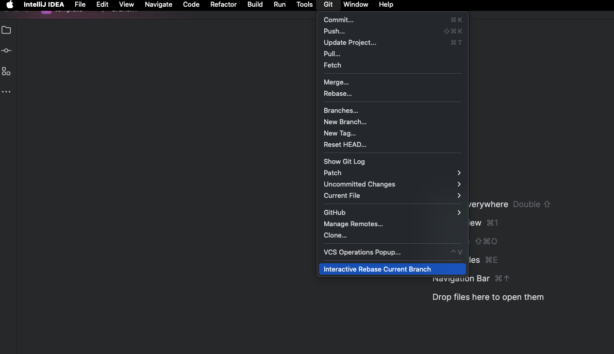

#  A More Interactive Rebase

---
<!-- Plugin description -->
A More Interactive Rebase for JetBrains is a plugin for the integrated development
environments (IDEs) from JetBrains. The tool makes it easier for you to perform Git Interactive Rebase actions, without 
the need for a command line, by providing a clear 
graphical visualization of the commit history and the changes you want to perform on it.

⚠️ DISCLAIMER:
This plugin is still under very early stages of development, consider this to be an access to the pre-alpha version
of the plugin. It may be possible that certain functionalities do not work as intended or do not work at all. Your
feedback would prove very useful for us. Thanks!
<!-- Plugin description end -->

## 📋 Table of Contents

1. ✨ [Features](#-features)
2. ⚙ [Installation](#-installation)
3.  ⚡ [Quick Start](#-quick-start)
4. 🔗 [Dependencies](#-dependencies)
5. 🤝 [Contributing](#-contributing)
6. ❓ [Support](#-support)
7. 🗺 [Roadmap](#-roadmap)
8. ✒ [Authors and Acknowledgement](#-authors-and-acknowledgment)

## ✨ Features
A More Interactive Rebase offers the following functionality for a better user experience:
* Opens in the editor tab for a better visualization
* Shows clearly the commit history in the form of a graph
* Gives details about the commits and their file changes
* Allows performing Interactive Rebase actions on selected commits
* Allows reordering of commits by drag-and-drop

[//]: # (Add short video here)

## ⚙ Installation
You can easily get started with setting up the plugin by following these guidelines:

### Guidelines for Setting up

1. Download the Plugin zip on your device
2. Extract the files in it in a folder
3. Open a JetBrains IDE and navigate to <kbd>Settings/Preferences</kbd> > <kbd>Plugins</kbd> >
   <kbd>⚙️</kbd> > <kbd>Install plugin from disk...</kbd>
4. Navigate to the folder of the Plugin and select `interactive-rebase-jetbrains-version.jar`
5. The Plugin should be in the list of Plugins and you can search for it by name *A More Interactive Rebase*
6. Click on the Plugin and enable it
7. Restart your IDE

## ⚡ Quick Start
### Opening the Plugin
Navigate to <kbd>Tools</kbd> > <kbd> Interactive Rebase Current Branch</kbd>. The Plugin opens as a file in
the editor tab. The branch drawn shows the latest commits on the checked out branch. Closing the Plugin and opening it
again keeps the changes that were made.

[//]: # (![entry.png]&#40;Images/entry.png&#41;)

[//]: # (![view.png]&#40;Images/view.png&#41;)

### Commit Information
Clicking on one or multiple commits selects them. The commit information and file changes of the selected commits
are presented on the right side of the screen. Double-clicking on a file change opens its diff and shows the changes.

[//]: # (![commit.png]&#40;Images/commit.png&#41;)

### Interactive Rebase Actions
After selecting the commits, the buttons that are *active* show the available Interactive Rebase actions. **It is
important to note that any changes made on the graph are not actually executed until the `Start Rebasing` button
is pressed. The idea of the graph is to show a preview of how the commit history will look in the end.** If you are 
not very
familiar with the Interactive Rebase actions that Git has to offer, you can read the
[Rewriting History](https://git-scm.com/book/en/v2/Git-Tools-Rewriting-History) Chapter provided by Git
for more information.

* **<u>Reword</u>** - If a single commit is selected you can click the `reword` button that opens a text field
  in place of the commit message. Alternatively, if there is no selected commit, you can just double-click on a
  commit message, which will also enable the text field. You can edit the message and press `Enter`.
  If you want to cancel your rewording, pressing `Escape` closes the text field.

[//]: # (![reword.gif]&#40;Images/reword.gif&#41;)
* **<u>Reorder</u>** - You can drag and drop the commits along the branch if you want to reorder them.
  

[//]: # (![reorder.gif]&#40;Images/reorder.gif&#41;)
* **<u>Drop</u>** - After selecting commits, pressing the `drop` button will remove the selected commits from the commit history.
  

[//]: # (![drop.gif]&#40;Images/drop.gif&#41;)

* **<u>Squash</u>** - If there is only one selected commit pressing the `squash` button will squash that commit with the
  previous one (older in the commit history). In the case where multiple commits are selected, they get squashed into
the oldest selected commit. After squashing, a text field opens for you to reword the commit message
  for the squashed commit.
* **<u>Fixup</u>** - If there is only one selected commit, pressing the `fixup` button will perform fixup of that
  commit with the previous one (older in the commit history). In the case where multiple commits are selected,
  they are fixed up into the oldest selected commit. This action combines automatically the commit messages of the
  selected commits.
* **<u>Stop to Edit</u>** - After selecting commits and pressing the `stop to edit` button the IDE opens each commit
  in chronological order (from oldest to newest) and allows you to make changes to that commit (amend it).
  After having made your changes, you have to stage them by typing `git add .`. Pressing `Continue` on the pop-up
  in the lower right corner of the screen will proceed with the rebasing of the next commit. You can also press
  `Abort` to stop the
  stop-to-edit action.
* **<u>Pick</u>** - Selecting the commits and pressing `Pick` reverts all changes done on them except for reordering.
* **<u>Reset</u>** - clicking the `Reset` button reverts the graph to its initial state,
  before any changes were indicated.
* **<u>Start Rebasing</u>** - Pressing `Rebase` starts the Interactive Rebase and executes all the changes
  that were made starting from the lowest changed commit on the graph.

### Keyboard Shortcuts
* **<u>Selecting a commit</u>** - Use arrow keys `↑` and `↓` to move up and down on a branch. Press `←` and `→` to move between branches. Use `Shift` for range selection.
*  **<u>Selecting multiple commits</u>** - Press `Shift` + `Click` for range selection and `Command`/`Ctrl` + `Click` for non-contiguous selection.
* **<u>Add branch</u>** - `Option`/`Alt` + `A`
* **<u>Undo</u>** - `Ctrl` + `Z`
* **<u>Redo</u>** - `Ctrl` + `Shift` + `Z`
* **<u>Collapse commits</u>** - `Option`/`Alt` + `C`
* **<u>Pick</u>** - `Option`/`Alt` + `P`
* **<u>Squash</u>** - `Option`/`Alt` + `S`
* **<u>Fixup</u>** - `Option`/`Alt` + `F`
* **<u>Reword</u>** - `Option`/`Alt` + `R`
* **<u>Drop</u>** - `Delete`
* **<u>Stop to Edit</u>** - `Option`/`Alt` + `E`
* **<u>Reset</u>** - `Ctrl` + `R`
* **<u>Start rebasing</u>** - `Option`/`Alt` + `Enter`

##  🔗 Dependencies

### IntelliJ OpenAPI
In order for our Plugin to interact with the current JetBrains IDEs we are making use of the
[Intellij Platform API](https://plugins.jetbrains.com/docs/intellij/explore-api.html). This streamlines the process of
building a Plugin by offering extension points to already existing functionality. It is the framework on which 
JetBrains' IDEs are based and provides a Virtual File System as a Component. The UI of this product is built using the
UI framework of IntelliJ Platform, specifically custom classes that extend the Swing functionality. 

### git4idea
To allow interaction with Git functionality, we use the [git4idea](https://plugins.jetbrains.com/plugin/13173-git)
Plugin as a library. It provides API for calling the Interactive Rebase of Git. In order to establish
the connection the folder git4ideaClasses in this project contains some of the git4Idea classes with the
respective copy right.

### IntelliJ Community
Our Plugin is compatible with [IntelliJ Community 2024.1](https://www.jetbrains.com/idea/download/other.html) and newer
versions. 
### Gradle
For managing the dependencies during runtime and testing we use
[Gradle 8.7](https://docs.gradle.org/8.7/release-notes.html). We have defined tasks for tools such as
Jacoco and Spotless.
### Kotlin
The plugin was developed in Kotlin, used with Java SDK 17 to ensure backwards compatibility. 
### Swing
The UI of the plugin was developed with Swing.
### Unit Testing
The product is unit tested with the frameworks JUnit 5 and Mockito, and the library AssertJ. All test classes are
extending the BasePlatformTestCase class of the intelliJ test Framework.
### Integration Testing
For system/integration testing the plugin uses
 
## 🤝 Contributing
If you want to contribute to our project please refer to the
[Contributing Guide](CONTRIBUTING.md).

## ❓ Support
For any questions and difficulties, please refer to our [Support guide](SUPPORT.md).

## 🗺 Roadmap
Since the project is still under development, here you can see the plan for the foreseeable future. You can see
the whole Roadmap via this [link](https://gitlab.ewi.tudelft.nl/groups/cse2000-software-project/2023-2024/cluster-p/12c/-/roadmap?state=all&sort=start_date_asc&layout=WEEKS&timeframe_range_type=CURRENT_QUARTER&progress=WEIGHT&show_progress=true&show_milestones=true&milestones_type=ALL&show_labels=false).
Keep in mind that opening it requires access to the repository.

## ✒ Authors and Acknowledgment
**Main contributors to the project are the members of our team:**
* Marina Mădăraş
* Diego Becerra Merodio
* Aleksandra Savova
* Ada Turgut
* Galya Vergieva

